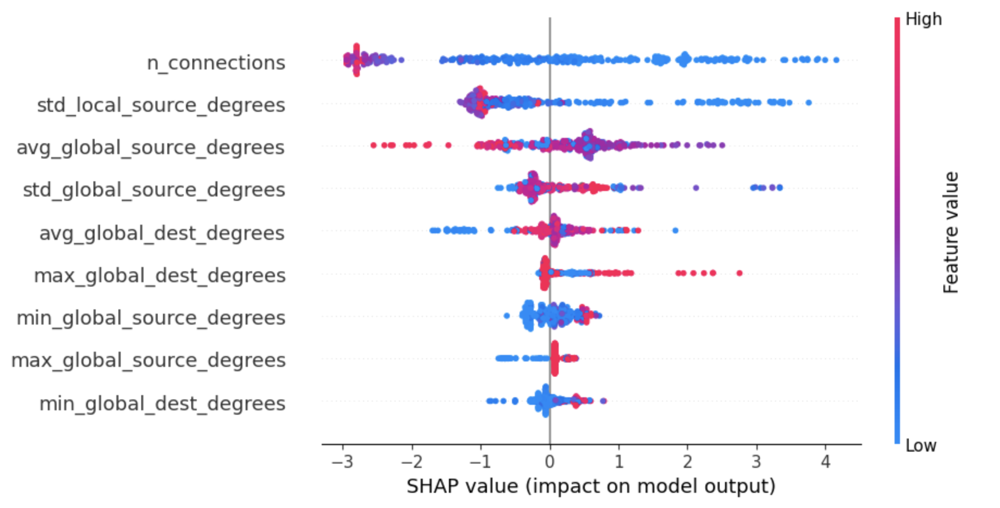
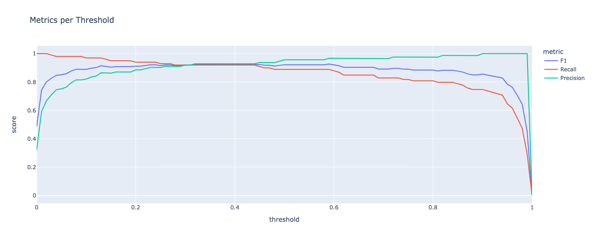

# API Security: Anomaly Detection App

## Dataset

The datasets were found on [Kaggle](https://www.kaggle.com/datasets/tangodelta/api-access-behaviour-anomaly-dataset/data). The tabular dataset (supervised_dataset.csv) and the graph dataset (supervised_call_graphs.json) were used for this project. (licensed under GPL-2).

Distributed micro-services based applications are typically accessed via APIs. The authors of this dataset have collected sequences of API calls from an application or accessed programmatic means and put them into a graph format. For this graph, they've generated common API access patterns (i.e. sequences of API calls) and have calculated user access metrics that can be used to classify these behaviors. They have also manually labeled a set of these behavior patters.

## Objectives

The main objective of this project is:

> **To develop a system that will be able to detect anomalous behavior from the API calls**

To achieve this objective, it was further broken down into the following 5 technical sub-objectives:

1. To perform in-depth exploratory data analysis of both datasets (tabular and graph)
2. To engineer new predictive features from the available graphs
3. To develop a supervised model solely from the engineered features to classify behavior into normal and anomalous
4. To recommend a threshold that will maximize model performance in terms of F1 score
5. To create an API endpoint for the trained model and deploy it
6. To test the performance of the API endpoint once deployed

## Main Insights

From the exploratory data analysis, we found out that anomalous behavior patterns are characterized by:

* IP's that are of *datacenter* type are anomalous
* Longer sequences with faster inter API access duration are not more likely to be anomalous
* Longer sequences with more distinct APIs in the behavior group are more likely to be anomalous

## Engineered Features

From the provided networks, the following 9 features were extracted:
 * Graph level features
   * *n_connections*: measures number of edges for a behavior and can indicate anomalous behavior if too large/small
 * Node level features
   * Global: measures node attributes across all the graphs in the data, and can indicate anomalous behavior if very high
     * *avg_global_source_degrees*
     * *std_global_source_degrees*
     * *min_global_source_degrees*
     * *max_global_source_degrees*
     * *avg_global_dest_degrees*
     * *min_global_dest_degrees*
     * *max_global_dest_degrees*
   * Local: measures node attributes across a specific graph, and can indicate anomalous behavior if very high
     * *std_local_source_degrees*

The engineered features were able to produce a ROC-AUC of 0.99, and has improved F1 score from the baseline statistical model by 0.3

## Model Selection
Models performance was measured using ROC AUC because we are doing a binary classification task. I used a Histogram Gradient Boosting Model because of its tree-based struture (accounting for label imbalance). The HGBT was tuned for 20 iterations. The best performing model contained the following parameters:

```json
{
    learning_rate: 0.1,
    max_iter: 60,
    max_leaf_nodes: 16,
    max_depth: 9,
    l2_regularization: 0.5451546397377538
    class_weight: 'balanced'
}
```


The HGBT model performs well, achieving ROC AUC and PR scores > 0.98.

### Model Explainability



The final model has a well balaned feature importance distribution, with 2 notable features being *n_connections* and *std_local_source_degrees*. The SHAP distributions are intuitive, as having a low number of connections and having low variation in the number of edges that come from a node could indicate that the behavior is a bot behavior to try to expose business logic, or could be part of a continuous attack of small behaviors to expose the API.

## Business Metrics

Determining the achieved business metrics can be done by first setting the model's threshold.



From the threshold analysis, we can see that F1 is the highest at the threshold of 0.59, and the maximum F1 score is 0.926

| Threshold  | 0.59 |
|------------|------|
| Precision  | 0.967|
| Recall     | 0.889|
| F1 Score   | 0.926|


## Prediction Service

For this project, the assumption is that feature engineering will be handled by another serivce, so the deployment part is responsible purely for the model inference.
To create the API locally, you'll need to use Docker. Run the following command if you don't have Docker installed.

```shell
pip install docker
```

### Step 1: Build Docker Image

Clone the repository and go to the folder with the Dockerfile. Then run the following command to build the image.

```shell
docker build -t prediction-app .
```

To check if the image was created successfully, run `docker images` in your CLI and you should see `prediction-app` listed.

### Step 2: Send the Request

To test if the API is working, you can run the the following command. 

```shell
docker run -it --rm -p 8989:8989 prediction-app
```

The `-it` flag makes the Docker image run in an interactive mode, so you will be able to see code logs in the shell. Type Ctrl+C to stop running if you see an error. The `--rm` flag removes the container once you stop running it, and is useful if you want this to be a temporary container. `-p 8989:8989` maps the port 8989 on your local machine to the container's port 8989. This will make your endpoint available at your local host at port 8989 (ie. http://0.0.0.0:8989).

### Testing

#### Measuring Latency

The following response times were measured locally by sending 1000 requests from one user:

| Response Time                 | Measure      |
|-------------------------------|--------------|
| Median Response Time          | 7 ms         |
| 95th Percentile Response Time | 14 ms        |
| Max Response Time             | 108 ms       |

We can see that the 95th percentile of requests experienced double the latency of the median request. Depending on the business use case, the latency at the 95th percentile might be too slow. The application might need to be optimized to fit the business needs.
To run these tests on your local machine, run the `app_response.py` script. You will need Python installed.

```shell
python app/app_response.py
```

## Future Work

#### Scalability

I aim to integrate Locust testing into this project to determine how scalable the application is on my local machine. This can also act as a framework for how I would implement Locust if this app were to be developed on a much more powerful server for a large network of users. The significant insight from this round of testing would be to determine the "breaking point" of my server, where performance starts to dip.

I ran Locust testing to determine the amount of users it would take for response time to dip significantly for **loading** up the app, and found no significant insights (loading up an app simply involves rendering the webpage). However, Locust testing (ie. swarming the app with 1000 users, with a spawn rate of 5 users/second) for making predictions on the app would reveal the threshold of users where performance starts to dip.

#### Pipelining

I aimed to create pipelines for steps of the modeling process (cleaning, feature engineering), but I would like to implement a machine learning training pipeline for easily reproducible modeling. I would likely use a service like ZenML/Metaflow/Kedro.


